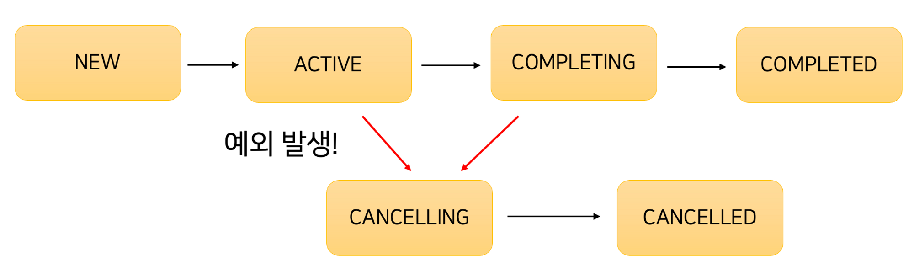

# 6강. Structured Concurrency
## 코루틴의 라이프 사이클
- 코루틴의 라이프 사이클은 아래와 같다.

- 여기서 굳이 `COMPLETING`을 거쳐서 `COMPLETED`로 가는 이유는 바로 자식 코루틴 때문이다.
- 자식 코루틴이 있을 경우 부모 코루틴은 모든 코드를 실행하면 `COMPLETING` 상태가 된다.
- 이후 자식 코루틴이 모두 종료되어야 비로소 `COMPLETED` 상태가 된다.
- 하지만 자식 코루틴 중 하나에서 예외가 발생하면 다른 자식 코루틴에게도 취소 요청을 보내고, 부모 코루틴은 `CANCELLING` 상태가 된다.
```kotlin
fun main(): Unit = runBlocking {
    launch {
        delay(600)
        printWithThread("첫 번째 코루틴")
    }

    launch {
        delay(500)
        throw IllegalArgumentException("코루틴 실패!")
    }
}
```
```
Exception in thread "main" java.lang.IllegalArgumentException: 코루틴 실패!
```
- `runBlocking` 코루틴은 자식 코루틴인 `launch`를 2개 생성하고 `COMPLETING` 상태로 대기하게 된다.
- 첫 번째 자식 코루틴은 600ms 후에 `printWithThread`를 호출하고, 두 번째 자식 코루틴은 500ms 후에 예외를 발생시킨다.
  - 이 때, 두 번째 자식 코루틴에서 발생한 예외가 부모 코루틴에 취소 신호를 보내서 부모 코루틴은 `CANCELLING` 상태가 된다.
  - 이로 인해, 아직 실행되지 않은 첫 번째 자식 코루틴까지 취소된다.
### Structured Concurrency
- 위의 예시처럼 부모-자식 관계의 코루틴이 하나로 움직이는 것을 **Structured Concurrency**라고 한다.
- 코틀린 공식 문서에서는 **Structured Concurrency**에 대해 다음과 같이 이야기 한다.
  - **Structured Concurrency**는 수많은 코루틴들이 유실되거나 누수되지 않도록 보장한다.
  - **Structured Concurrency**는 코드 내의 에러가 유실되지 않고 적절히 보고될 수 있도록 보장한다.
- 지금까지의 내용을 정리하면 다음과 같다.
  - 부모 코루틴이 취소되면 자식 코루틴들도 함께 취소된다.
  - 자식 코루틴에서 예외가 발생하면 **Structured Concurrency**로 인해 부모 코루틴이 취소된다.
    - `CancellationException`은 예외가 아닌 정상 취소로 간주하기 때문에 부모 코루틴에 전파되지 않아서 다른 자식 코루틴도 취소되지 않는다.
  