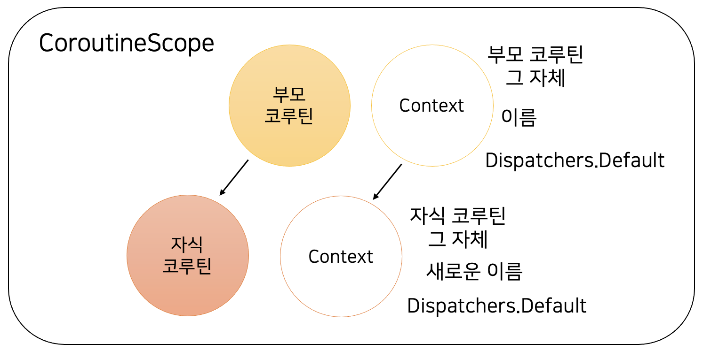

# 7강. CoroutineScope와 CoroutineContext
## CoroutineScope
- CoroutineScope는 코루틴의 범위를 나타내는 인터페이스이다.
- 지금까지 사용하던 `launch()`와 `async()`는 CoroutineScope의 확장 함수이다.
- 기본적으로는 `runBlocking`이 CoroutineScope를 구현하지만 CoroutineScope를 직접 구현할 수도 있다.
- `main` 함수를 일반 함수로 만들어서 `Thread.sleep()` 등을 사용해서 코루틴이 끝날 때 까지 대기시킬 수도 있고, `main`을 suspend 함수로 만들어서 `join()` 등의 동작을 수행할 수도 있다.
```kotlin
fun main() {
    CoroutineScope(Dispatchers.Default).launch {
        delay(1000)
        printWithThread("runBlocking을 사용하지 않고 생성한 CoroutineScope!")
    }

    Thread.sleep(1500)
    printWithThread("main 종료")
}
```
```
[DefaultDispatcher-worker-2 @coroutine#1] runBlocking을 사용하지 않고 생성한 CoroutineScope!
[main] main 종료
```
```kotlin
suspend fun main() {
    CoroutineScope(Dispatchers.Default).launch {
        delay(1000)
        printWithThread("runBlocking을 사용하지 않고 생성한 CoroutineScope!")
    }.join()

    printWithThread("main 종료")
}
```
```
[DefaultDispatcher-worker-1 @coroutine#1] runBlocking을 사용하지 않고 생성한 CoroutineScope!
[DefaultDispatcher-worker-1 @coroutine#1] main 종료
```
- CoroutineScope의 주요 역할은 CoroutineContext를 보관하는 것이다.

```kotlin
 interface CoroutineScope {
    val coroutineContext: CoroutineContext
}
```
## CoroutineContext
- 코루틴과 관련된 여러가지 데이터를 갖고 있다.
  - 코루틴의 이름
  - CoroutineExceptionHandler
  - 코루틴의 Job
  - CoroutineDispatcher : 코루틴이 실행될 스레드를 결정한다.


- 위 그림의 경우 CoroutineScope에 포함된 CoroutineContext에는 부모 코루틴의 Job과 이름, `Dispatchers.Default`가 저장되어 있다.
- 부모 코루틴이 자식 코루틴을 생성하면 동일한 CoroutineScope에 생성되고, 이 영역의 context에 자식 코루틴의 이름과 Job 등과 같은 필요한 정보를 덮어 써서 새로운 context를 생성한다.
- 이렇게 한 영역에 있는 코루틴들은 CoroutineScope 자체를 `cancel()`하면 모두 종료된다.
  - 만약 어떤 클래스 내부에 독립적인 CoroutineScope가 있을 때 해당 클래스에서 사용하던 코루틴을 한 번에 종료시킬 수도 있다.
```kotlin
class AsyncClass {
    private val scope = CoroutineScope(Dispatchers.Default)
    
    fun print() {
        scope.launch {
          printWithThread("특정 클래스의 독립적인 CoroutineScope!")
        }
    }

  fun destroy() {
    scope.cancel()
  }
}
```
```kotlin
val asyncLogic = AsyncClass()
asyncLogic.print()

asyncLogic.destroy()    // 필요가 없어지면 코루틴을 모두 정리
```
- CoroutineContext는 Map과 비슷하게 key - value로 이루어져 있고, 동일한 Key를 가진 데이터는 하나만 존재할 수 있다.
- key - value의 쌍을 Element라고 하며, `+`를 통해 Element를 합치거나 기존 context에 Element를 추가하여 새로운 context를 만들 수 있다.
- `+` 연산자를 통해 context를 합치면, 동일한 key를 가진 Element는 오른쪽에 있는 Element로 덮어쓰여진다.
- `minusKey()`를 통해 특정 key를 가진 Element를 제거한 새로운 context를 만들 수 있다.
### CoroutineDispatcher
- CoroutineDispatcher는 코루틴이 실행될 스레드를 결정한다.
- 코루틴은 중단되었다가 다른 스레이드에 배정될 수도 있는데, 이 때 CoroutineDispatcher가 코루틴을 스레드에 배정하는 역할을 수행한다.
- CoroutineDispatcher의 종류
  - Dispatchers.Default : 가장 기본적인 디스패처. CPU 사용량이 많은 작업을 수행하는 코루틴에 적합하며, 별도로 설정하지 않는다면 이 옵션이 사용된다.
  - Dispatchers.IO : I/O 작업을 수행하는 코루틴에 적합하다. 네트워크 요청이나 파일 입출력 등이 해당된다.
  - Dispatchers.Main : UI 컴포넌트를 조작하기 위한 디스패처. 안드로이드나 다른 UI 관련 의존성과 같이 특정 의존성을 갖고 있어야 정상적으로 활용할 수 있다.
  - Java의 스레드풀인 ExecutorService를 디스패처로 변환 : ExecutorService의 확장 함수인 `asCoroutineDispatcher()`를 사용하면 ExecutorService를 CoroutineDispatcher로 변환할 수 있다.
