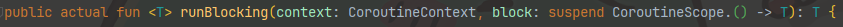
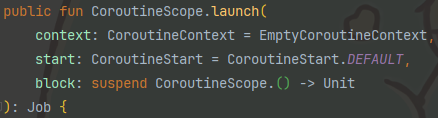
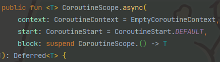

# 8강. suspending function
- suspending function은 지금까지 사용해온 `suspend`가 붙은 함수를 의미하며, 내부에서 다른 `suspend` 함수를 호출할 수 있다.
```kotlin
fun main(): Unit = runBlocking {
    delay(1000)
}
```
- 위 코드 상에는 `suspend fun`이 없는데도 불구하고 `suspend fun`인 `delay()`를 호출하고 있다.
  - 이는 `runBlocking`에서 인자로 받는 람다에 `suspend`가 명시되어 있기 때문이다.
    
    
  - `runBlocking`뿐만 아니라 `launch`나 `async` 등의 메소드도 마찬가지로 람다에 `suspend`가 명시되어 있기 때문에 `suspend fun`을 호출할 수 있다.
    
    
    
- 이렇게 `suspend`가 붙은 람다를 `suspending lambda`라고 부른다.
## suspending function
- `suspending function`은 코루틴이 **중지되었다가 재개될 수 있는 지점**이 되며, 이를 `suspension point`라고 부른다.
  - 여기서 중지된다는 것은 반드시 중지되는 것이 아니라 **중지될 수도 있다**는 것을 의미한다.
- `suspending function`을 사용하면 여러 비동기 라이브러리를 사용할 수 있도록 도와준다.
```kotlin
fun main(): Unit = runBlocking {
    val result1 = async { apiCall1() }
    val result2 = async { apiCall2(result1.await()) }
    printWithThread(result2.await())
}

fun apiCall1(): String {
    Thread.sleep(1000)
    return "World"
}

fun apiCall2(name: String): String {
    Thread.sleep(1000)
    return "Hello, $name!"
}
```
- 위 코드에서는 `async`와 `Deffered`를 활용하여 콜백을 활용하지 않게 되지만 오히려 `Deffered`에 의존적인 코드가 된다는 단점이 있다.
- 이 상황에서 `Deffered` 대신 `CompletableFuter`나 `Reactor`와 같은 다른 비동기 라이브러리로 변경해야할 경우가 생기면 코드에 큰 변화가 올 수 있다.
- 이러한 문제를 해결하기 위해 `suspending function`을 사용하면 된다.
```kotlin
fun main(): Unit = runBlocking {
    val result1 = async { apiCall1() }
    val result2 = async { apiCall2(result1.await()) }
    printWithThread(result2.await())
}

suspend fun apiCall1(): String {
    return CoroutineScope(Dispatchers.Default).async {
        delay(1000)
        "World"
    }.await()
}

suspend fun apiCall2(name: String): String {
    return CompletableFuture.supplyAsync {
        Thread.sleep(1000)
        "Hello, $name!"
    }.await()
}
```
- 이와 같이 `apiCall1()`과 `apiCall2()`를 `suspending function`으로 변경하면 어떤 라이브러리를 사용할지는 메소드 내부에서 결정하면 된다.
- `suspending function`은 인터페이스에서도 사용할 수 있으며, 해당 인터페이스의 구현체 클래스는 `suspending function`을 재정의 할 때 반드시 `suspend` 키워드를 붙여야 한다.
  - 이로 인해 요구사항에 따라 인터페이스 구현체 별로 다른 비동기 라이브러리를 사용할 수 있다.
## 코루틴 라이브러리에서 기본으로 제공하는 suspending function들
### `coroutineScope`
- `coroutineScope`는 `launch`나 `async`처럼 새로운 `CoroutineScope`를 생성하지만 생성과 동시에 코루틴이 바로 실행된다는 특징이 있다.
- `coroutineScope`를 통해 생성된 코루틴은 모두 완료되어야 다음 코드로 넘어간다.
```kotlin
fun main(): Unit = runBlocking {
    printWithThread("START")
    printWithThread(calculateResult())
    printWithThread("END")
}

private suspend fun calculateResult() = coroutineScope {
    val num1 = async {
        delay(1000)
        100
    }

    val num2 = async {
        delay(1000)
        200
    }

    num1.await() + num2.await()
}
```
```
[main @coroutine#1] START
[main @coroutine#1] 300
[main @coroutine#1] END
```
- `coroutineScope`는 다른 코루틴들을 동시에 여러개 사용하고 싶고, 이들을 또다른 메소드로 분리하고 싶을 때 사용하면 좋다.
### `withContext`
- `withContext`는 `coroutineScope`와 비슷하지만, `withContext`는 context에 변화를 줄 수 있다.
  - Dispatcher를 변경하는 등의 처리가 가능하다.
```kotlin
fun main(): Unit = runBlocking {
    printWithThread("START")
    printWithThread(calculateResult())
    printWithThread("END")
}

private suspend fun calculateResult() = withContext(Dispatchers.Default) {
    val num1 = async {
        delay(1000)
        100
    }

    val num2 = async {
        delay(1000)
        200
    }

    num1.await() + num2.await()
}
```
```
[main @coroutine#1] START
[main @coroutine#1] 300
[main @coroutine#1] END
```
### `withTimeout` / `withTimeoutOrNull`
- `withTimeout`는 지정한 시간 내에 코루틴이 완료되지 않으면 `TimeoutCancellationException`을 발생시킨다.
- `withTimeoutOrNull`은 지정한 시간 내에 코루틴이 완료되지 않으면 `null`을 반환한다.
```kotlin
fun main(): Unit = runBlocking {
    printWithThread(withTimeout(1000) {
        delay(1500)
        "END"
    })
}
```
```
[main @coroutine#1] Exception in thread "main" kotlinx.coroutines.TimeoutCancellationException: Timed out waiting for 1000 ms
```
```kotlin
fun main(): Unit = runBlocking {
    printWithThread(withTimeoutOrNull(1000) {
        delay(1500)
        "END"
    })
}
```
```
[main @coroutine#1] null
```